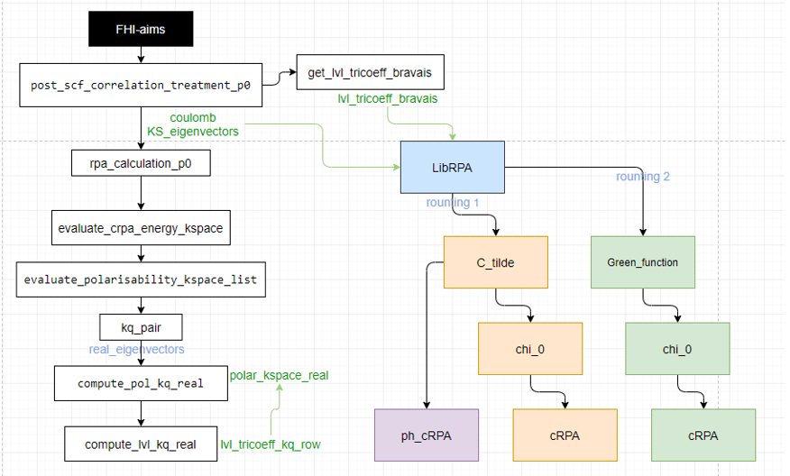

# LibRPA

LibRPA is a library offering access to physical properties computed using many-body perturbation theory.

## How to compile?

LibRPA uses cmake to build the project.
You can run the following cmake commands to build LibRPA

```shell
# build under `build` directory
# with LibRI switched off
cmake -B build
# with LibRI switched on
cmake -B build -DUSE_LIBRI=ON \
    -DCEREAL_INCLUDE_DIR=/path/to/cereal/include \
    -DLIBRI_INCLUDE_DIR=/path/to/libRI/include \
    -DLIBCOMM_INCLUDE_DIR=/path/to/LibComm/include
# start the make jobs
cmake --build build -j 4
```

## Interfaced with FHI-aims

At this stage, LibRPA have interfaced with FHI-aims by writing and reading files:

- stru_out
- band_out
- KS_eigenvector_#.txt
- Cs_data_#.txt
- coulomb_mat_#.txt

The modified FHI-aims code files can be checked in `FHI-aims-outifile-code/`. \
Consider the different versions of FHI-aims, you had better modify the FHI-aims files manual instead of recovering them.\
Take care the new variable declarations in the beginning and the places of writing files.
For convenience, we provide patch files in `interfaces/FHI-aims`. You may find the one appropriate \
for your aims version.

Once you successfully finished FHI-aims calculation, the out-files will be ready for LibRPA. \
Then run LibRPA in the same working directory.

## Running LibRPA

LibRPA can be parallelized to hundreds of cores by MPI+openmp.\
There are two input parameters needed to be care: 1) The minimax grids number; 2) The Green function threshold.
When you run LibRPA, the two parameters needed to be offered, like:

```shell
$ mpirun /home/rongshi/LibRPA/chi0_main.exe 16 1e-4 > LibRPA_$workdir.$SLURM_JOB_ID.out
```

Other input parameters are parsed by specifying keyword and value pair in file `librpa.in` at the same directory.
For example, if you want to set Coulomb threshold to `1e-5` and task to G0W0, you can write `librpa.in` as

```
task = g0w0
vq_threshold = 1e-5
```

If you would like to compute `chi0` by using LibRI, you need to specify it besides compiling the program with LibRI,
as it is an experimental feature and prone to show some bugs.
You can switch on it by setting in `librpa.in`

```
parallel_routing = libri
```

If `librpa.in` or the related keyword is not found, the default value will be used.

<!-- ### Code design



 -->

## Documentation
Comprehensive documentation, including installation guides, user guides, and tutorials, can be found [here](https://srlive1201.github.io/LibRPA/).