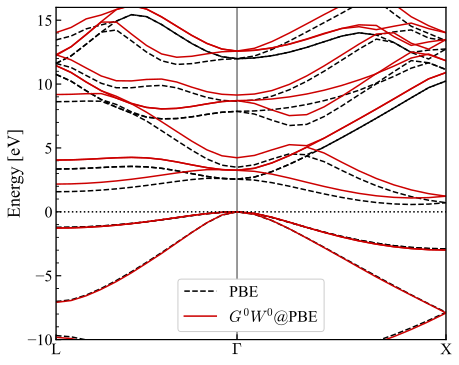

# *G*{sup}`0`*W*{sup}`0` quasi-particle band structure with FHI-aims dataset

This tutorial guides you through the process of setting up and running a calculation using FHI-aims for geometry and SCF computations, and LibRPA for quasi-particle energies by one-shot GW method.

The silicon unit cell is used as test case.

## 1. **Prerequisites**
Before starting, ensure that you have:
- [FHI-aims](https://fhi-aims.org/get-the-code-menu/get-the-code) installed with `USE_GREENX` set to `ON`.
- LibRPA [installed](../../../user_guide/install.md) with [LibRI enabled](<librpa-use-libri>).

## 2. **FHI-aims Input Files**
These files are required to run the initial SCF and geometry optimization using FHI-aims:
- **`control.in`**: This file contains control parameters for FHI-aims. Below is an example:
  ```text
  # Basic model
  xc               pbe
  k_grid           4 4 4
  occupation_type  gaussian 0.001

  # GW switches
  qpe_calc         gw_expt
  freq_grid_type   minimax
  frequency_points 16
  anacon_type      1

  # Output flags
  output librpa
  output band   0.50000  0.50000  0.50000   0.00000  0.00000  0.00000 13 L G
  output band   0.00000  0.00000  0.00000   0.50000  0.00000  0.50000 13 G X

  [light species default for Si]
  ```
- **`geometry.in`**: Contains the geometry of the system. For silicon:
  ```text
  lattice_vector   3.8301668167   0.0000000000   0.0000000000
  lattice_vector   1.9150834084   3.3170217640   0.0000000000
  lattice_vector   1.9150834084   1.1056739213   3.1273181102
  atom_frac        0.0000000000   0.0000000000   0.0000000000  Si
  atom_frac        0.2500000000   0.2500000000   0.2500000000  Si
  ```

Then run FHI-aims by

```bash
mpirun -np 4 /path/to/bin/aims.x > aims.out
```

It takes about 30 seconds to finish on an M2 Max Macbook Pro laptop.
This will generate dataset files (~500 MB) for the LibRPA driver.

## 3. **LibRPA Input File**

LibRPA requires **`librpa.in`** which specifies the parameters.
For one-shot GW calculation for band structure, it looks like:

```text
task = g0w0_band
nfreq = 16
option_dielect_func = 0
replace_w_head = t
parallel_routing = libri
```

Here `replace_w_head` is switched on, so that LibRPA uses the dielectric function
directly computed in FHI-aims for the correction of dielectric matrix to speed up
k-point convergence.

## 4. **Run GW with LibRPA**

After obtaining the output files from FHI-aims and setting up the parameters in `librpa.in`,
you can run the LibRPA driver at the same working directory to calculate the quasi-particle band structure:

```bash
mpirun -np 4 /path/to/LibRPA/build/chi0_main.exe > LibRPA.out
```

On the same laptop, this takes about 1.7 hour.
The calculation can be sped up if more MPI tasks and/or OpenMP threads are used.

## 5. **Analyze LibRPA Output**

After successful run, you can find in `LibRPA.out` the quasi-particle energies and its compositions
for states on the regular k-grid:
```text
spin  1, k-point    1: (0.00000, 0.00000, 0.00000) 
----------------------------------------------------------------------------------------------------------------------------
State              occ             e_mf             v_xc            v_exx           ReSigc           ImSigc             e_qp
----------------------------------------------------------------------------------------------------------------------------
    1          2.00000      -1789.50277       -153.07760       -244.87703          8.90359          3.15362      -1872.39861
    2          2.00000      -1789.50277       -153.07762       -244.87688          8.90214          3.15478      -1872.39990
...
   11          2.00000        -17.67291        -12.19859        -19.21812          6.69564         -0.86364        -17.99680
   12          2.00000         -5.63619        -13.27559        -14.75075          1.24879         -0.00015         -5.86256
   13          2.00000         -5.63548        -13.27912        -14.75356          1.24876         -0.00015         -5.86116
   14          2.00000         -5.63533        -13.27943        -14.75386          1.24871         -0.00015         -5.86104
   15          0.00000         -3.07993        -11.57831         -7.20939         -3.90052         -0.01063         -2.61152
   16          0.00000         -3.07901        -11.57980         -7.21005         -3.90139         -0.01064         -2.61065
   17          0.00000         -3.07776        -11.58158         -7.21096         -3.90154         -0.01066         -2.60869
   18          0.00000         -2.14654        -14.88107         -9.67057         -4.69199         -0.01374         -1.62803
...
   49          0.00000         48.77341        -11.89143         -2.44414        -25.95775         -4.20613         32.26294
   50          0.00000         94.46523        -19.21422         -6.75051         20.24488        -42.71633        127.17381

spin  1, k-point    2: (0.00000, 0.00000, 0.33333) 
----------------------------------------------------------------------------------------------------------------------------
...
```

The columns in the above output have the following meanings:

- `State`: band index $n$
- `occ`: occupation number $f_{nk}$ (read from input)
- `e_mf`: Kohn-Sham mean-field eigenvalue $E^{\mathrm{KS}}_{nk}$ (read from input)
- `v_xc`: exchange-correlation potential $v^{\mathrm{xc}}_{nk}$ (read from input)
- `v_exx`: exact-exchange potential $v^{\mathrm{exx}}_{nk}$
- `ReSigc`: real part of the correlation self-energy $\Re\Sigma^{\mathrm{c}}_{nk}$
- `ImSigc`: imaginary part of the correlation self-energy $\Im\Sigma^{\mathrm{c}}_{nk}$
- `e_qp`: resulting quasiparticle energy $E^{\mathrm{QP}}_{nk}$. It is computed as

  $$
  E^{\mathrm{QP}}_{nk} = E^{\mathrm{KS}}_{nk} - v^{\mathrm{xc}}_{nk} + v^{\mathrm{exx}}_{nk} + \Re\Sigma^{\mathrm{c}}_{nk}
  $$

All energy quantities are given in eV.

For band calculations with the `g0w0_band` task, LibRPA also writes the band-structure results to the following files:

- `KS_band_spin_<ispin>.dat`: input Kohn-Sham band structure, for reference
- `EXX_band_spin_<ispin>.dat`: non-self-consistent exact-exchange-only band structure
- `GW_band_spin_<ispin>.dat`: GW quasiparticle band structure

All of these band-structure files use the same format as the corresponding
FHI-aims output files and can therefore be post-processed in the same way using
existing FHI-aims scripts.
The **main difference** is in the energy reference: FHI-aims aligns the band
energies to the Fermi level, whereas LibRPA uses its internal energy zero.
The PBE and *GW* band structures of this case is plotted in {numref}`fig-band-si`.

:::{figure-md} fig-band-si
{align=center}

Band structure of Silicon, one-shot GW from LibRPA
:::
